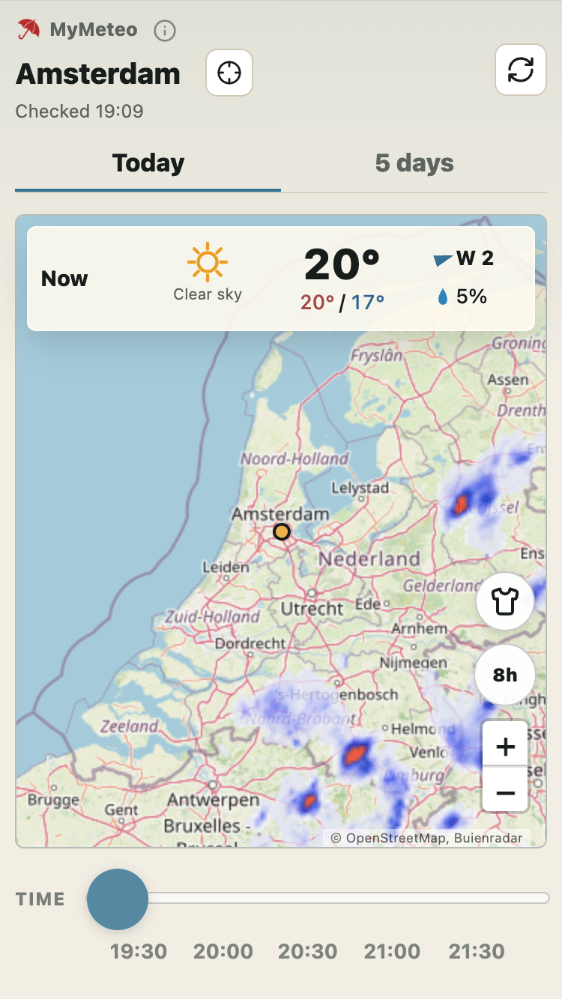
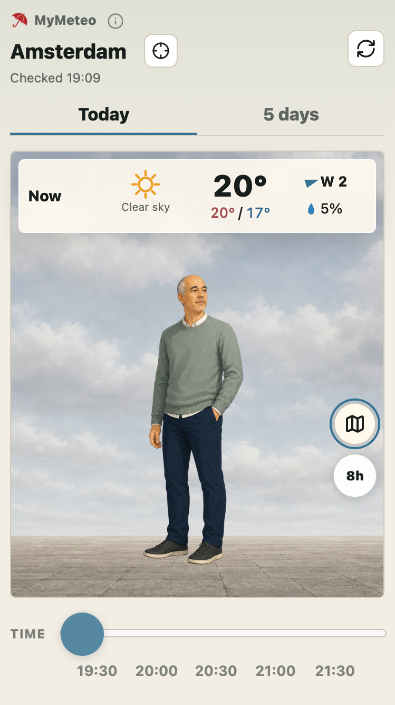
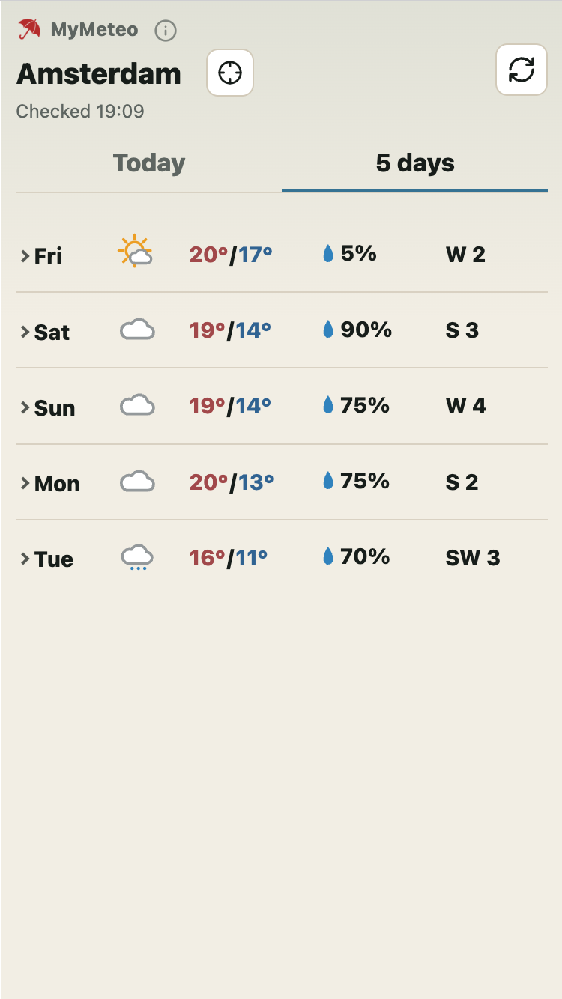

# MyMeteo

MyMeteo is a small personal weather dashboard with location search, current-location support, live weather, outfit suggestions, a 5-day outlook, and moving rain radar.

[Open MyMeteo](https://msmeehui.github.io/mymeteo/)

<p>
  
  
  
</p>

## Features

- Search for a city or place and load the local forecast
- Use the browser's current-location permission to check the weather nearby
- View current temperature, conditions, rain, wind, and daily highs/lows
- Switch between rain radar, outfit suggestions, and a 5-day forecast table
- Animate rain radar frames with a time slider
- Install-friendly icons and web app manifest

## Open Locally

You can open `index.html` directly in a browser, but serving the folder locally is usually more reliable for browser features and external data requests:

```sh
python3 -m http.server 4173 --bind 127.0.0.1
```

Then visit:

```text
http://127.0.0.1:4173/
```

## Add MyMeteo To Your Phone

You can add MyMeteo to your phone's home screen so it opens like an app.

### iPhone Or iPad

1. Open MyMeteo in Safari.
2. Tap the Share button.
3. Tap Add to Home Screen.
4. Keep the name "MyMeteo" or choose your own name, then tap Add.

### Android

1. Open MyMeteo in Chrome.
2. Tap the More menu.
3. Tap Install app or Add to Home screen.
4. Confirm by tapping Install or Add.

After that, you can open MyMeteo from the icon on your home screen.

## Data Sources

No API key is required. The app uses public weather and map sources:

- Forecast data: [Open-Meteo Forecast API](https://open-meteo.com/)
- Location autocomplete: [Open-Meteo Geocoding API](https://open-meteo.com/en/docs/geocoding-api)
- Current-location names: [OpenStreetMap Nominatim](https://nominatim.openstreetmap.org/)
- Rain radar animation: [Buienradar](https://www.buienradar.nl/)
- Near-term rain chance in the Netherlands: Open-Meteo adjusted with Buienradar for the first 8 hours
- Radar frame decoding: [gifuct-js](https://github.com/matt-way/gifuct-js) through [esm.sh](https://esm.sh/)
- Fallback radar tiles: [LibreWXR](https://librewxr.net/)
- Map tiles: [OpenStreetMap](https://www.openstreetmap.org/) through [Leaflet](https://leafletjs.com/)
- Weather icons: custom MyMeteo SVG icons in `assets/weather-icons-mymeteo/`

## Notes

- Current-location mode auto-refreshes on open when browser geolocation permission is already granted.
- The app needs an internet connection because weather, radar, map tiles, and external libraries are loaded from public services.
- This is a static HTML, CSS, and JavaScript project, so it can be hosted with GitHub Pages.

## License

This project is available under the [MIT License](LICENSE).
