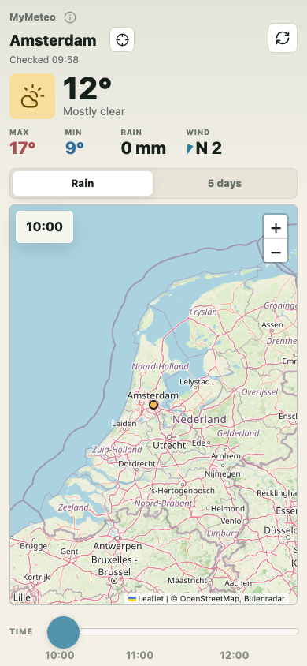

# MyMeteo

MyMeteo is a small personal weather dashboard with location search, current-location support, live weather, a 5-day outlook, and moving rain radar.



## Features

- Search for a city or place and load the local forecast
- Use the browser's current-location permission to check the weather nearby
- View current temperature, conditions, rain, wind, and daily highs/lows
- Switch between rain radar and a 5-day forecast table
- Animate rain radar frames with a time slider
- Install-friendly icons and web app manifest

## Open Locally

You can open `index.html` directly in a browser, but serving the folder locally is usually more reliable for browser features and external data requests:

```sh
python3 -m http.server 4173 --bind 127.0.0.1
```

Then visit:

```text
http://127.0.0.1:4173/
```

## Data Sources

No API key is required. The app uses public weather and map sources:

- Forecast data: [Open-Meteo Forecast API](https://open-meteo.com/)
- Location autocomplete: [Open-Meteo Geocoding API](https://open-meteo.com/en/docs/geocoding-api)
- Rain radar animation: [Buienradar](https://www.buienradar.nl/)
- Radar frame decoding: [gifuct-js](https://github.com/matt-way/gifuct-js) through [esm.sh](https://esm.sh/)
- Fallback radar tiles: [LibreWXR](https://librewxr.net/)
- Map tiles: [OpenStreetMap](https://www.openstreetmap.org/) through [Leaflet](https://leafletjs.com/)

## Notes

- Current-location mode only runs after the visitor grants browser geolocation permission.
- The app needs an internet connection because weather, radar, map tiles, and external libraries are loaded from public services.
- This is a static HTML, CSS, and JavaScript project, so it can be hosted with GitHub Pages.

## License

This project is available under the [MIT License](LICENSE).
