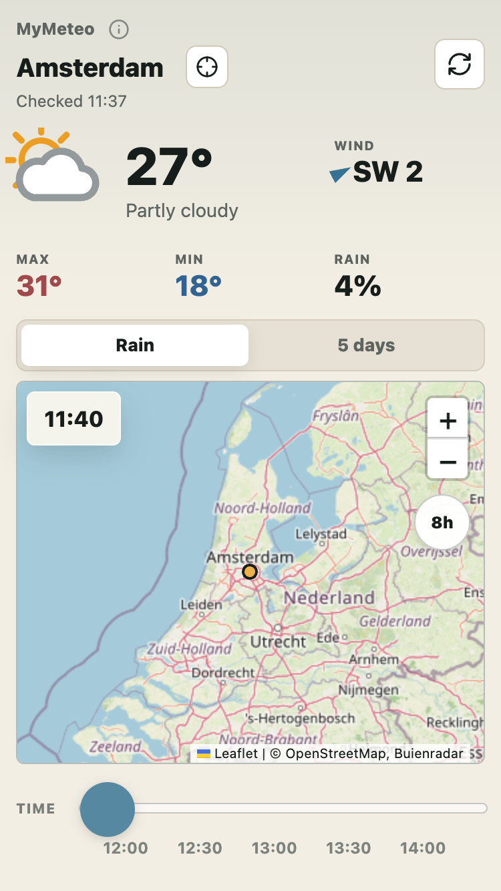
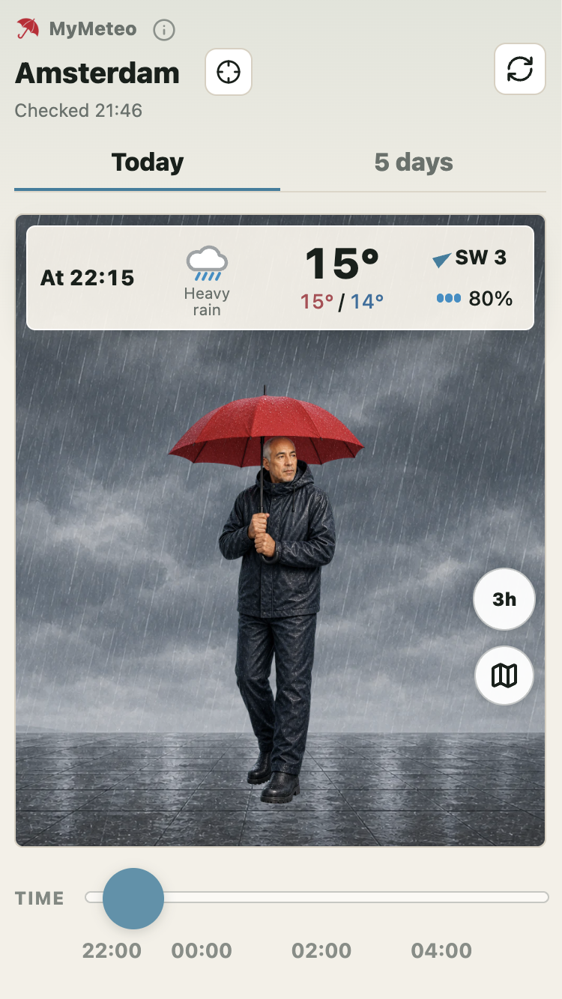
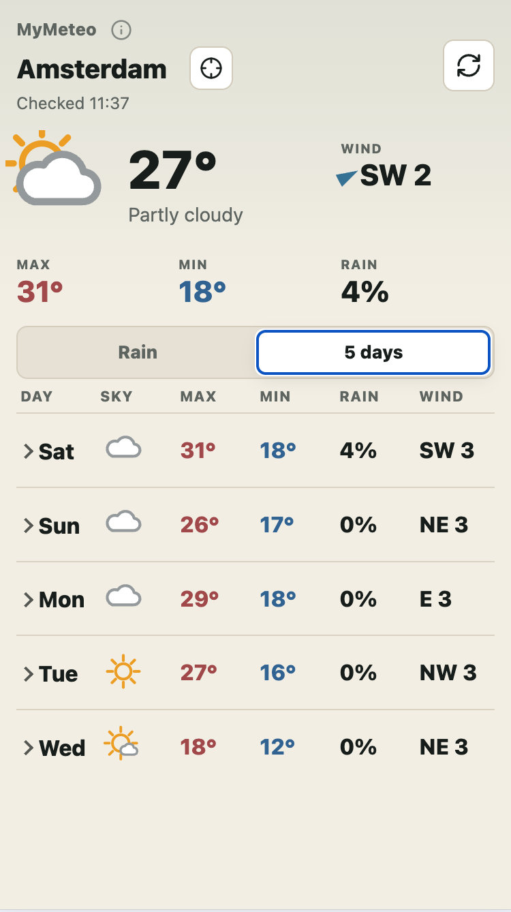

# MyMeteo

MyMeteo is a small personal weather dashboard with location search, current-location support, live weather, outfit suggestions, a 5-day outlook, and moving rain radar.

[Open MyMeteo](https://msmeehui.github.io/mymeteo/)

<p>
  
  
  
</p>

## Features

- Search for a city or place and load the local forecast
- Use the browser's current-location permission to check the weather nearby
- View current temperature, conditions, rain, wind, and daily highs/lows
- Switch between rain radar, outfit suggestions, and a 5-day forecast table
- Animate rain radar frames with a time slider
- Install-friendly icons and web app manifest

## Open Locally

You can open `index.html` directly in a browser, but serving the folder locally is usually more reliable for browser features and external data requests:

```sh
python3 -m http.server 4173 --bind 127.0.0.1
```

Then visit:

```text
http://127.0.0.1:4173/
```

## Add MyMeteo To Your Phone

You can add MyMeteo to your phone's home screen so it opens like an app.

### iPhone Or iPad

1. Open MyMeteo in Safari.
2. Tap the Share button.
3. Tap Add to Home Screen.
4. Keep the name "MyMeteo" or choose your own name, then tap Add.

### Android

1. Open MyMeteo in Chrome.
2. Tap the More menu.
3. Tap Install app or Add to Home screen.
4. Confirm by tapping Install or Add.

After that, you can open MyMeteo from the icon on your home screen.

## Data Sources

No browser API key is required. Netherlands KNMI WMS requests are routed through the Cloud86 PHP proxy in `api/knmi-wms.php`, with the real key stored outside the public web root. The app uses these weather and map sources:

- Forecast data: [Open-Meteo Forecast API](https://open-meteo.com/)
- Location autocomplete: [Open-Meteo Geocoding API](https://open-meteo.com/en/docs/geocoding-api)
- Current-location names: [OpenStreetMap Nominatim](https://nominatim.openstreetmap.org/)
- Rain radar animation in the Netherlands: [KNMI](https://www.knmi.nl/) for the first 2 hours, then [Buienradar](https://www.buienradar.nl/) for longer range and fallback
- Near-term rain in the Netherlands: the Today card follows the displayed KNMI/Buienradar radar image when it can be read at the selected location; KNMI point rain and then Buienradar/Open-Meteo provide fallback and longer-range guidance
- Thunderstorm icon support: Open-Meteo weather codes plus CAPE/lightning-potential signals for cautious heavy-rain storm upgrades
- Radar frame decoding: [gifuct-js](https://github.com/matt-way/gifuct-js) through [esm.sh](https://esm.sh/)
- Fallback radar tiles: [LibreWXR](https://librewxr.net/)
- Map tiles: [OpenStreetMap](https://www.openstreetmap.org/) through [Leaflet](https://leafletjs.com/)
- Privacy-friendly usage statistics: [Simple Analytics](https://www.simpleanalytics.com/)
- Weather icons: custom MyMeteo SVG icons in `assets/weather-icons-mymeteo/`

## Server Cache And Tests

The KNMI proxy keeps complete cached responses in hourly folders under `v2/` inside the existing private cache directory. Fresh responses are reused for 4 minutes (5 minutes for capabilities); connection or upstream failures may use a response no older than 30 minutes. Cache storage failures do not prevent a valid upstream response from reaching the app.

Cleanup runs in short, rate-limited passes during normal requests. It preserves every response still eligible for fallback and removes wholly expired hourly folders plus obsolete legacy `.body`/`.json` cache files. The first request after upgrading fetches a new response because the old two-file format is no longer read. No configuration change or cron job is needed.

Run the browser-logic regressions with `npm test`. For the server cache and HTTP failure/concurrency checks, install PHP CLI with cURL and run:

```sh
npm run test:proxy
```

If PHP is not on `PATH`, set `MYMETEO_PHP_BINARY` to its executable path. These checks use temporary directories, a synthetic key and a local fake KNMI service; they never use the real server configuration or contact KNMI.

For a proxy-only update, upload `api/knmi-wms.php` to the same server path. Keep the private configuration and cache directory in place.

## Notes

- Current-location mode auto-refreshes on open when browser geolocation permission is already granted.
- The app needs an internet connection because weather, radar, map tiles, and external libraries are loaded from public services.
- This is a static HTML, CSS, and JavaScript project, so it can be hosted with GitHub Pages.

## License

This project is available under the [MIT License](LICENSE).
