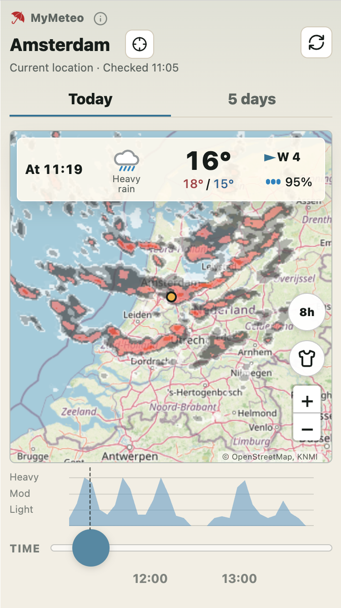
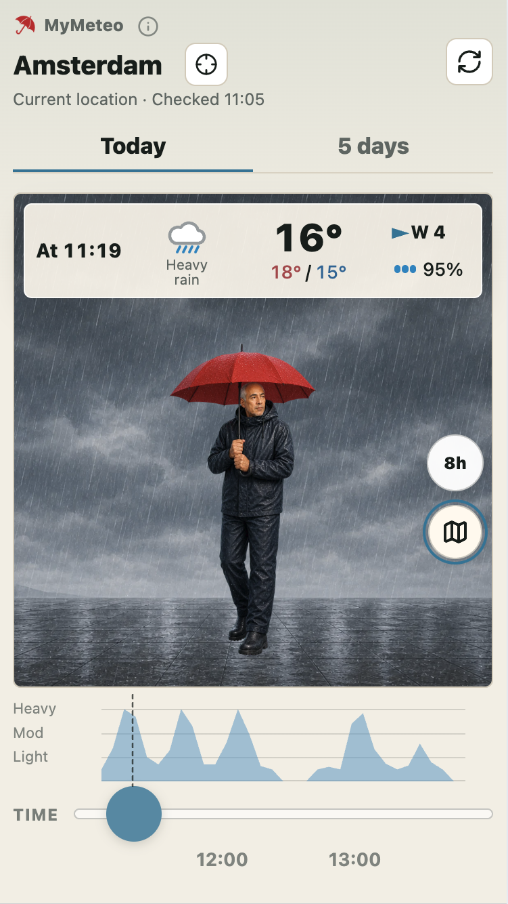
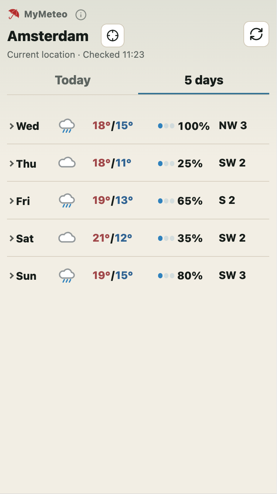

# MyMeteo

MyMeteo is a compact, mobile-first weather app for checking the weather, seeing when rain is coming, choosing what to wear, and planning the next five days. Search for a place or use your current location.

[Open MyMeteo](https://mymeteo.nl/)

<p>
  
  
  
</p>

## Features

- Search for a city or place, or use your current location; your chosen location is remembered for next time
- Check temperature, weather conditions, daily highs/lows, wind, and rain chance in a compact Today view
- Scrub the radar timeline to explore upcoming rain, with the map, weather card, and clothing suggestion following the selected time
- See the timing and intensity of local rain in a precipitation graph coordinated with the radar
- Switch between the radar map and illustrated clothing suggestions, including scenes for after dark
- Scan a five-day forecast starting with today, then expand a day for hourly detail
- Use KNMI radar for the first two hours in the Netherlands, with Buienradar for longer range and fallback, and LibreWXR outside the Netherlands or when Dutch radar is unavailable
- Add MyMeteo to your phone's home screen for quick access

## Live Site And Hosting

The main app is [mymeteo.nl](https://mymeteo.nl/), hosted on Cloud86. The older [GitHub Pages address](https://msmeehui.github.io/mymeteo/) redirects there, preserving URL parameters and fragments from existing links.

The interface is HTML, CSS, and JavaScript, but KNMI radar also requires the PHP proxy at `api/knmi-wms.php` and its private server configuration. GitHub Pages cannot run PHP, so a standalone static copy cannot provide the full Netherlands radar experience. It can use Buienradar or LibreWXR when those services are available.

## Open Locally

Serve the project folder with a local web server:

```sh
python3 -m http.server 4173 --bind 127.0.0.1
```

Then visit:

```text
http://127.0.0.1:4173/
```

This is enough to preview the interface and use public forecast and fallback radar services. Python's static server does not execute PHP, so KNMI radar and point rain are unavailable in this setup. To develop with KNMI locally, use a PHP server with cURL and configure the proxy with a KNMI WMS key stored outside the public web root. Use the live site for the fully configured app.

## Add MyMeteo To Your Phone

You can add MyMeteo to your phone's home screen so it opens like an app.

### iPhone Or iPad

1. Open MyMeteo in Safari.
2. Tap the Share button.
3. Tap Add to Home Screen.
4. Keep the name "MyMeteo" or choose your own name, then tap Add.

### Android

1. Open MyMeteo in Chrome.
2. Tap the More menu.
3. Tap Install app or Add to Home screen.
4. Confirm by tapping Install or Add.

After that, you can open MyMeteo from the icon on your home screen.

## Data Sources

No browser API key is required. Netherlands KNMI WMS requests are routed through the Cloud86 PHP proxy in `api/knmi-wms.php`, with the real key stored outside the public web root. The app uses these weather and map sources:

- Forecast data: [Open-Meteo Forecast API](https://open-meteo.com/)
- Location autocomplete: [Open-Meteo Geocoding API](https://open-meteo.com/en/docs/geocoding-api)
- Current-location names: [OpenStreetMap Nominatim](https://nominatim.openstreetmap.org/)
- Rain radar animation in the Netherlands: [KNMI](https://www.knmi.nl/) for the first 2 hours, then [Buienradar](https://www.buienradar.nl/) for longer range and fallback
- Near-term rain in the Netherlands: the Today card, precipitation graph, and clothing suggestion follow the displayed KNMI/Buienradar radar image when it can be read at the selected location and time; KNMI point rain and then Buienradar/Open-Meteo provide fallback and longer-range guidance
- Thunderstorm icon support: Open-Meteo weather codes plus CAPE/lightning-potential signals for cautious heavy-rain storm upgrades
- Radar frame decoding: [gifuct-js](https://github.com/matt-way/gifuct-js) through [esm.sh](https://esm.sh/)
- Fallback/outside-Netherlands radar: [LibreWXR](https://librewxr.net/); the Today graph and rain condition use the exact location in the same displayed frames. Unknown local readings withhold the detailed graph instead of drawing hourly model rain as continuous minute-level rainfall.
- Map tiles: [OpenStreetMap](https://www.openstreetmap.org/) through [Leaflet](https://leafletjs.com/)
- Privacy-friendly usage statistics: [Simple Analytics](https://www.simpleanalytics.com/)
- Weather icons: custom MyMeteo SVG icons in `assets/weather-icons-mymeteo/`

## Server Cache And Tests

The KNMI proxy keeps complete cached responses in hourly folders under `v2/` inside the existing private cache directory. Fresh responses are reused for 4 minutes (5 minutes for capabilities); connection or upstream failures may use a response no older than 30 minutes. Cache storage failures do not prevent a valid upstream response from reaching the app.

Cleanup runs in short, rate-limited passes during normal requests. It preserves every response still eligible for fallback and removes wholly expired hourly folders plus obsolete legacy `.body`/`.json` cache files. The first request after upgrading fetches a new response because the old two-file format is no longer read. No configuration change or cron job is needed.

Run the browser-logic regressions with `npm test`. For the server cache and HTTP failure/concurrency checks, install PHP CLI with cURL and run:

```sh
npm run test:proxy
```

If PHP is not on `PATH`, set `MYMETEO_PHP_BINARY` to its executable path. These checks use temporary directories, a synthetic key and a local fake KNMI service; they never use the real server configuration or contact KNMI.

For a proxy-only update, upload `api/knmi-wms.php` to the same server path. Keep the private configuration and cache directory in place.

## Notes

- Current-location mode auto-refreshes on open when browser geolocation permission is already granted.
- The app needs an internet connection because weather, radar, map tiles, and external libraries are loaded from public services.

## License

This project is available under the [MIT License](LICENSE).
